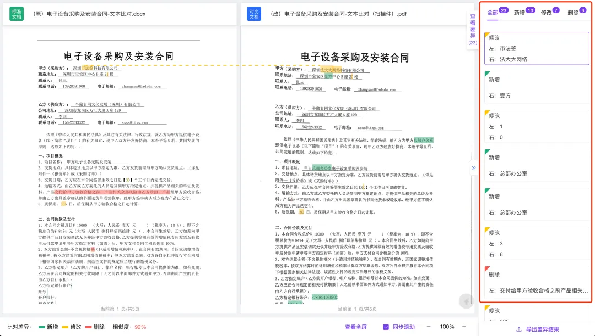
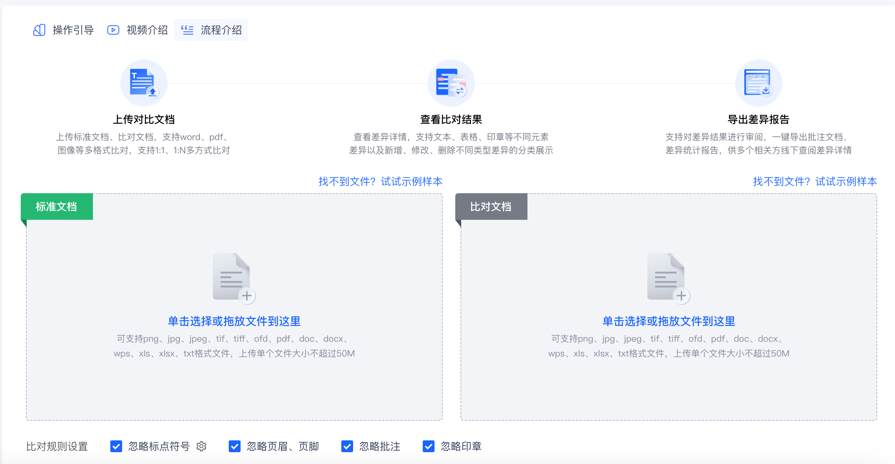
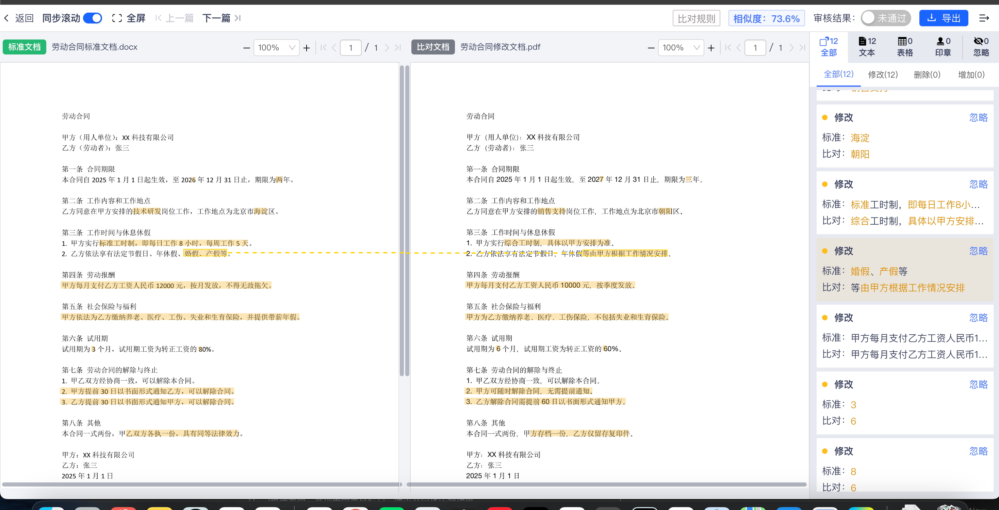

### 国内产品列表
| 产品名称                | 所属公司               | 官网地址                                      | 核心对比审查功能                                                |
|-------------------------|------------------------|-----------------------------------------------|---------------------------------------------------------|
| 法大大 - 合同对比      | 深圳法大大网络科技有限公司 | [https://www.fadada.com/](https://www.fadada.com/) | 跨页精准比对、印章类型识别与主体匹配校验、差异内容彩色标记（红删/绿增/黄改），支持多种文件格式，支持差异导出 |
| 幂律智能 - ContractLaw  | 北京幂律智能科技有限公司  | [https://www.pacteraedge.com/](https://www.pacteraedge.com/) | NLP语义冲突识别（如权利义务倒置风险）、OCR扫描件解析、条款逻辑一致性校验                 |
| TextIn智能合同审查      | 合合信息                | [https://www.textin.com/product/textin_contract](https://www.textin.com/product/textin_contract) | 跨行跨页全文比对、印章/表格差异展示、分钟级百页文档比对（准确率超90%）                   |
法大大产品：

TextIn产品功能：
- 多格式、多元素、多文档支持
- 导出差异文件
- 合同内容对比
- 支持表格对比

### 国外产品列表
| 产品名称                | 所属公司               | 官网地址                                      | 核心对比审查功能                                                                 |
|-------------------------|------------------------|-----------------------------------------------|----------------------------------------------------------------------------------|
| Ironclad AI             | Ironclad Inc.          | [https://ironcladapp.com/product/ai-based-contract-management/](https://ironcladapp.com/product/ai-based-contract-management/) | AI自动红线建议、194+合同属性检测、基于自定义规则的条款合规性校验                 |
| DocuSign Insights       | DocuSign Inc.          | [https://www.docusign.com/](https://www.docusign.com/) | 文档智能差异分析、OCR扫描件解析、与CRM系统同步比对结果                           |
| Contract Sent           | Contract Sent          | [https://www.contractsent.com/](https://www.contractsent.com/) | 一键侧边栏比对、关键条款自动高亮、秘密链接分享协作审查                           |
| WordsCompare            | WordsCompare           | [https://wordscompare.com/](https://wordscompare.com/) | 字符级差异检测、多设备适配、法律文档专用比对模式（支持合同修订追踪）             |
| Adobe Acrobat Pro - 文本比对 | Adobe Inc.         | [https://www.adobe.com/](https://www.adobe.com/) | PDF/Word格式兼容、基础文字差异标记、跨平台同步比对结果                           |